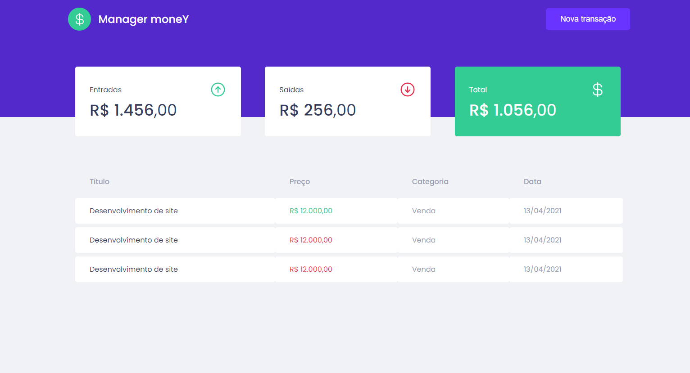

# Manager-Money
</img>
<h4>Um gerenciador de gastos util para o dia a dia.<h4>
<h3>Techs e libs usadas</h3>
<ul>
  <li>React JS</li>
  <li>Phosphor Icons</li>
  <li>Sass</li>
  <li>Axios</li>
  <li>Mirage JS</li>
</ul>
Layout do projeto <a href="https://www.figma.com/file/0xmu9mj2TJYoIOubBFWsk5/dtmoney-Ignite-(Copy)?node-id=1%3A863">aqui</a>
<h2>Configurar e executar</h2>

Primeiro clone este repositório e instale todas as dependências usando o comando <code>yarn install</code> na pasta do projeto em um terminal de sua escolha.

Depois que a configuração estiver concluída, está tudo pronto, basta executar <code>yarn start</code> para ver o projeto em execução no navegador.

